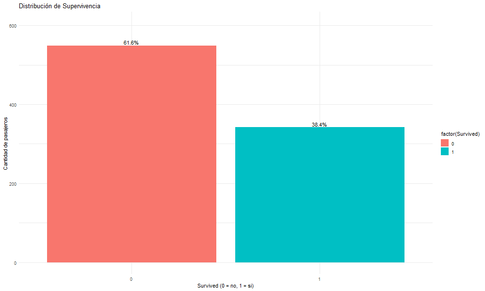
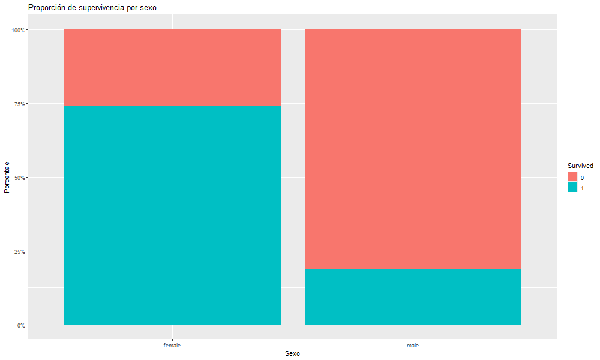
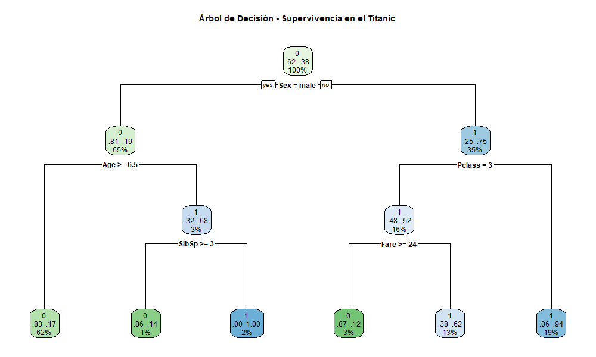

# PROYECTO TITANIC

- Villanueva, Carlos Matias
- Del Bo, Tomas
- Sebben, Agustina
- Paberolis, Ignacio

Basados en el archivo titanic.csv, el objetivo de este proyecto es predecir si un pasajero sobrevivió o no al desastre del Titanic utilizando técnicas de limpieza de datos y modelado predictivo en R.
Se dividio el dataset en dos, uno para entrenar el modelo y otro para hacer las predicciones.

En la carpeta Output se encuentran los resultados obtenidos al ejecutar el proyecto y el arbol.

## Para ejecutar el proyecto:

### OPCION 1 - Con R:
``` R
  source("make.R")
```

### OPCION 2 - Desde terminal:
```R
  Rscript make.R
```

### OPCION 3 - Con make (si tienes Makefile):
```bash
  make run
```

## Archivos del proyecto:
  - input/ *Carpeta con los datos de entrada*
  - output/ *Carpeta con los resultados para los datos de prubea*
  - 01_limpieza.R *Limpia los datos*
  - 02_logica.R   *Entrena el modelo*
  - 03_resultado.R *Genera predicciones*
  - 04_graficos_exploratorios
  - make.R         *Ejecuta*

## Requisitos: 
- Tener R instalado

---

# 1. Introducción

El objetivo de este trabajo práctico es construir e interpretar un modelo de árboles de decisión (CART) para predecir la supervivencia de los pasajeros del Titanic. Se aplican las etapas vistas en la materia: comprensión del problema, preparación de los datos, entrenamiento, evaluación y explicación del modelo final.

---

# 2. Entendimiento y análisis del conjunto de datos

El dataset contiene información registrada para cada pasajero del Titanic, incluyendo:

- Un identificador del pasajero (**PassengerId**).  
- La variable objetivo **Survived** (1 = sobrevivió, 0 = no sobrevivió).  
- Variables asociadas al viaje y características del pasajero:  
  **Pclass**, **Sex**, **Age**, **SibSp**, **Parch**, **Fare**, **Embarked**, entre otras.

## 2.1 Análisis exploratorio inicial

Como primer paso se exploró la distribución de **Survived** para entender el nivel de desbalance de clases. La proporción de sobrevivientes no es extrema, lo cual permite entrenar un árbol de clasificación.




A nivel exploratorio se observaron patrones clásicos del problema Titanic:

- Las **mujeres** tienen una probabilidad de supervivencia claramente mayor que los hombres.  
- Los pasajeros de **primera clase (Pclass = 1)** presentan mayor supervivencia que los de clases más bajas.  
- La **edad** también influye: los niños presentan tasas de supervivencia superiores a las de los adultos.

Estos patrones sugieren que variables como **Sex**, **Pclass** y **Age** serán candidatas naturales para aparecer en los primeros niveles del árbol.




## 2.2 Calidad del dataset y decisiones de limpieza

Se identificó la presencia de datos faltantes en:

- **Age**  
- **Fare**  
- **Embarked**

Las decisiones de limpieza fueron:

- Eliminación de columnas textuales o difíciles de utilizar directamente (**Name**, **Ticket**, **Cabin**).  
- Conversión de variables categóricas a factor (por ejemplo, **Survived**, **Sex**, **Pclass**, **Embarked**).  
- Imputación de **Age** con la mediana.  
- Imputación de **Fare** y **Embarked** según moda o mediana.  
- Mantenimiento del resto de las variables tal como están para su uso en CART.  


---

# 3. Construcción del modelo CART

Para el modelado se utilizó un árbol de decisión de tipo CART mediante la función `rpart`.

### Variables utilizadas

- Variable objetivo: **Survived**.  
- Variables predictoras: **Pclass**, **Sex**, **Age**, **SibSp**, **Parch**, **Fare**, **Embarked**.

### Parámetros del modelo

Se eligieron parámetros de control razonables para evitar sobreajuste:

- `minsplit = 10` (mínimo de observaciones para intentar una división).  
- `minbucket = 5` (mínimo de observaciones en un nodo terminal).  
- `cp = 0.01` (parámetro de complejidad para controlar el crecimiento del árbol).  
- `maxdepth = 5` (profundidad máxima del árbol).

El modelo se entrenó sobre el conjunto de entrenamiento, manteniendo un conjunto de prueba separado para la evaluación externa.

## 3.1. Arbol de decisión


---

# 4. Evaluación del modelo

La evaluación del modelo CART se realizó utilizando el conjunto de entrenamiento, aplicando las predicciones generadas por el árbol y comparándolas con los valores reales de la variable Survived.

En primer lugar, se obtuvo la **matriz de confusión**, que permite observar cuántos casos fueron correctamente clasificados y cuántos fueron asignados erróneamente a cada clase. Esta matriz proporciona una primera aproximación del desempeño del modelo distinguiendo entre aciertos y errores en ambas categorías (sobrevive / no sobrevive).

A partir de esta matriz, se calculó la métrica principal:

- **Accuracy**: proporción total de observaciones correctamente clasificadas por el modelo.Resultado obtenido 83.15%

El valor de accuracy obtenido en el conjunto de entrenamiento mostró que el árbol CART es capaz de capturar los patrones principales del dataset y superar la predicción aleatoria, reflejando la estructura subyacente del problema.


---

# 5. Interpretación del modelo CART

El árbol ajustado para el Titanic refleja patrones coherentes con el conocimiento previo del problema:

- La primera división se realiza sobre **Sex**, indicando que el género es la variable más influyente en la supervivencia.  
- En ramas donde `Sex = female`, el modelo asigna en general una probabilidad alta de supervivencia, especialmente si además la pasajera viaja en **primera o segunda clase**.  
- En ramas donde `Sex = male`, la probabilidad de no sobrevivir es mayor, aunque se matiza mediante variables como **Pclass**, **Age** y **SibSp/Parch**.  
- La **clase del pasaje (Pclass)** separa fuertemente a los pasajeros de primera clase (mayor probabilidad de supervivencia) de los de tercera clase.  
- La **edad** refina la decisión, destacando el principio de “mujeres y niños primero”: los niños tienen mayor probabilidad de haber sobrevivido.

Cada rama del árbol puede interpretarse como un **perfil de pasajero** con una determinada probabilidad de supervivencia.

---

# 6. Conclusiones finales

1. El análisis exploratorio del dataset Titanic permitió identificar patrones claros en la supervivencia de los pasajeros, destacándose el rol del **sexo**, la **clase del pasaje** y la **edad**.  

2. El modelo CART construido sobre las variables Pclass, Sex, Age, SibSp, Parch, Fare y Embarked logró un buen equilibrio entre **precisión** e **interpretabilidad**.  

3. Las reglas de decisión obtenidas son coherentes con los hechos históricos (por ejemplo, “mujeres y niños primero”) y permiten explicar de manera intuitiva cómo se asignan las probabilidades de supervivencia según el perfil de cada pasajero.  

4. La poda del árbol, guiada por el parámetro de complejidad **cp** y la validación cruzada, fue clave para evitar el sobreajuste y obtener un modelo más robusto ante nuevos datos.  

---
